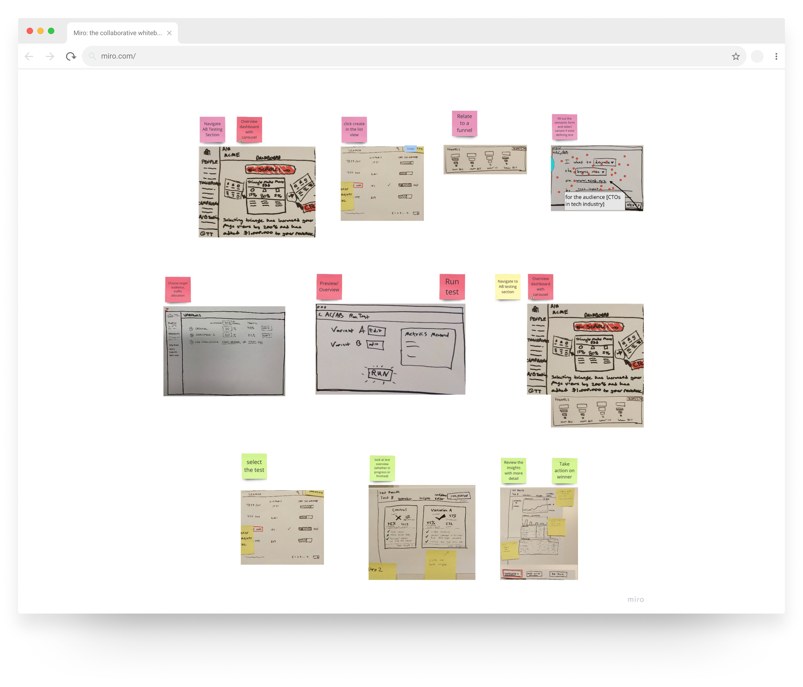
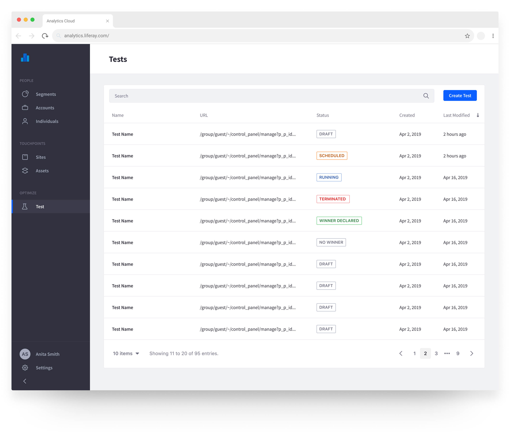
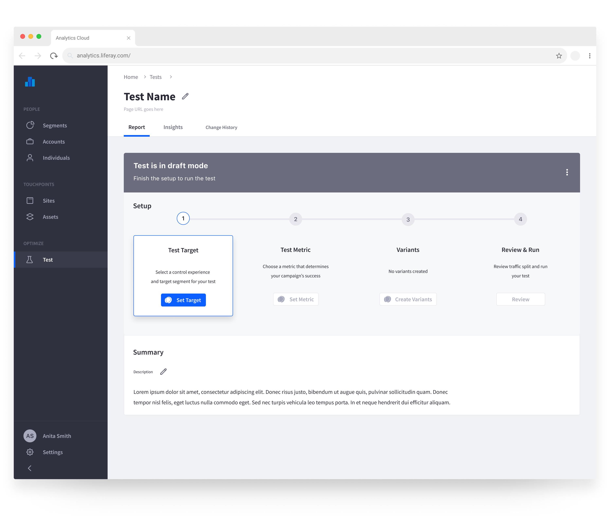
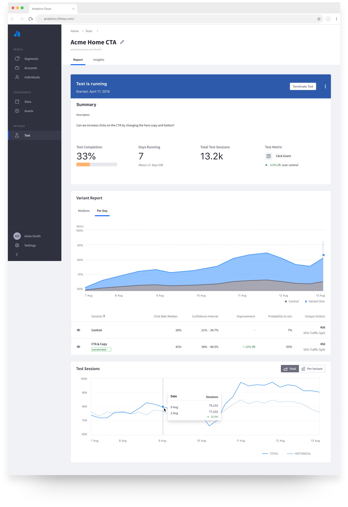
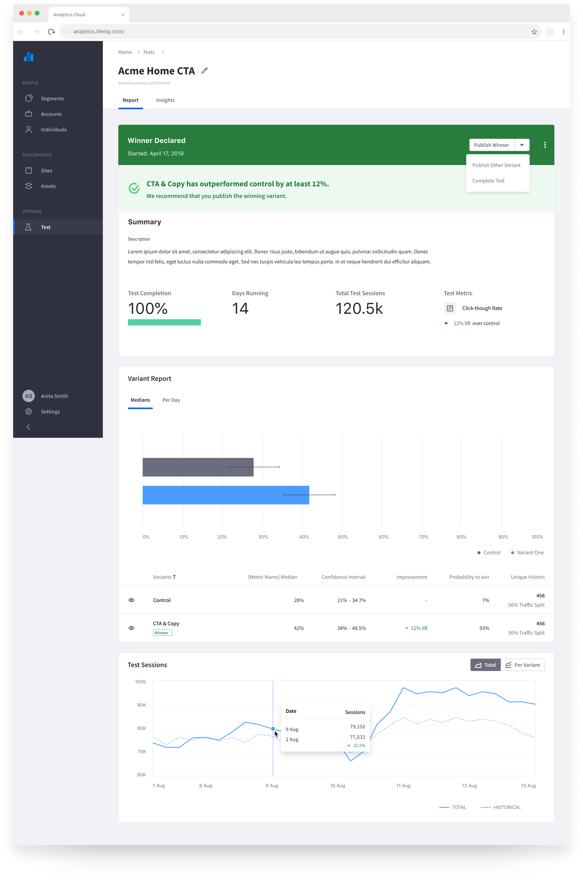

#### About the project
Shortly after joining the Analytics Cloud team at [Liferay](https://www.liferay.com), I had the chance to work on the new A/B testing feature for the platform. The team kicked-off the project with a design sprint, and after that, I was the sole designer working on the Analytics Cloud side of the project.
  

My responsibilities for this project included:
- Establishing a cross-product user flow and getting approval from multiple stakeholders
- Collaborating with a designer from Liferay DXP to ensure cross-product consistency
- Working within and expanding upon our design system to build the A/B testing UI on Analytics Cloud
- Working internationally with our development team in Brazil
    

The resulting feature was deeply integrated with Liferay's Digital Experience Platform (DXP). Leveraging the site-building capabilities in DXP, users can quickly make a new A/B test on a page, set a metric to measure, select an element to track click events on if necessary, select a target audience, and run the test. Liferay's Analytics Cloud then does the heavy lifting tracing and reporting the data for the test and eventually gives the user a test result, with the handy option to publish the winning variant directly from the report. Although it was very much an MVP for an A/B testing feature, it meets our customers' basic needs and has laid the groundwork for future enhancements like multivariate and redirect testing.
  

#### *Full case study coming soon.*
  
###### Some sketches from the sprint

  

###### High Level Flow

  

###### State management
<iframe src="https://sketch.systems/jamesjlyons/sketch/413f3350c6ae1759c7ce582768ecf8a1" width="100%" height="600" frameborder="0"></iframe>
 

Interactive statechart for A/B test status

   

###### A/B Test Interface

Test List

   

Test Setup Process

   

Test Running Dashboard

   

Test Complete Dashboard

   
