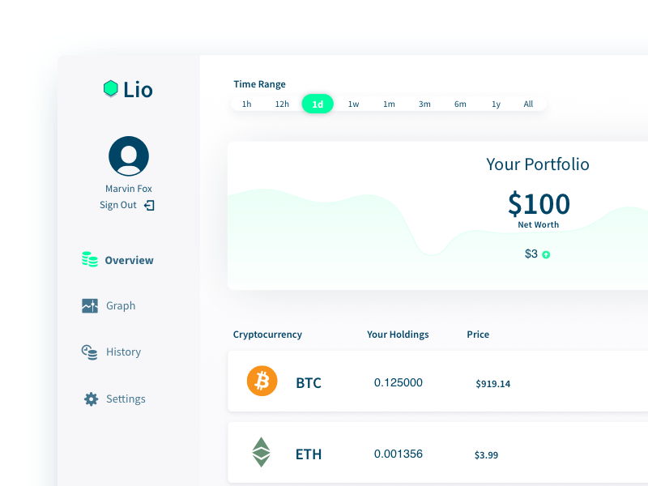

#### Why we built Lio
In the fall of 2017, the awesome team over at [Blockstack](https://blockstack.org) was having their first contest to build apps for their decentralized platform, and the requirement was to build a cryptocurrency portfolio app than ran on Blockstack technology. Lio was built as a challenge for me and Alec, my development partner at [Tap Five](https://tapfive.io), to see what we could build in a short amount of time and possibly place well in the contest. We decided to focus on a market that we knew well, users who wanted dead-simple portfolio tracking. We also used this as an opportunity to use and learn Vue for our front-end framework

<!-- #### The Process
To work at a quick pace, basic designs were made in Sketch, shared and approved in Abstract, and then iterated upon in the code. For the development process, Alec focused on getting the app code structure solid -->

<!-- ##### The Landing Page

##### The Portfolio Overview

##### The Breakdowns

##### The History Page -->

#### Results
Did we win the contest? No. But it was a lot of fun to build, and the team who reviewed our app at Blockstack ranked the design and code highly.
Lio is also what ultimately gave us the idea to have a business name to work under since we would have two projects now (the other being [Subdivide](/project/subdivide). Lio is live in the Blockstack app listings, so feel free to give it a spin [here](https://lioapp.io).

<!--  -->
