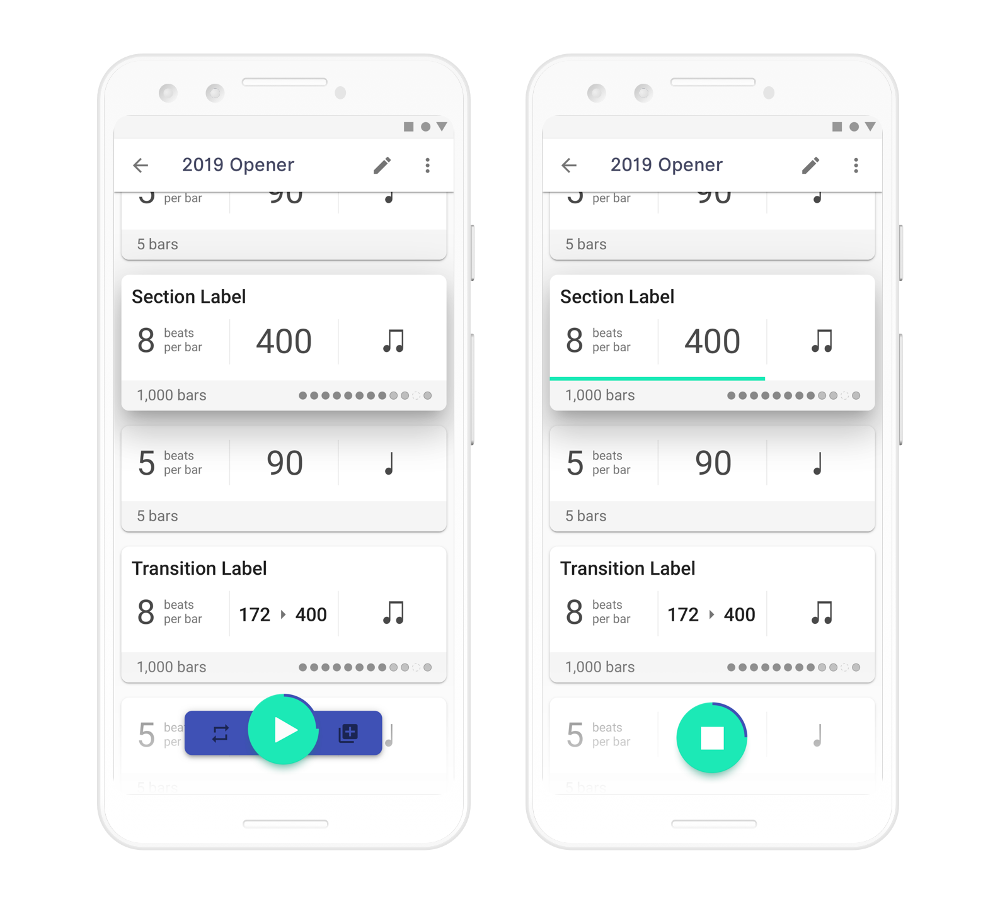

#### How Subdivide Began
Subdivide is a side project that developed out of seeing a clear need for a better metronome with features specifically for the marching arts. With the industry standard being a clunky hadware metronome that costs $200, me and my developer friend saw an opportunity to upgrade the experience of using a metronome during practice through an app. Subdivide has gone through a few iterations now, and is currently in the process of being designed and developed for iOS too.
    

#### The Features
Since the idea of having a metronome as an app isn't a new one, there were already a handful of features that were required for an MVP. These included the ability to quickly set a tempo, change the time signature (what we call Beats per Bar), set accent patterns, and set subdvisions for the beats. In Subdivide, these all reside in the main metronome screen, along with the ability to save configurations as presets for easy access. Beats per bar, accent patterns, subdivisions, and presets are all located in a bar at the bottom of the screen for easy thumb access because these are the options most likely to be changed on-the-fly while the metronome is running. Changing tempo on-the-fly is possible through the buttons by the tempo indicator, but our main differentiating feature, Tracks, solves the most common use case of that need.
    

<!--  -->

<iframe src="https://metronome-screen.now.sh/" width="320" height="640" frameborder="0"></iframe>
 
<h6 class="center">Prototype with clickable buttons in the bottom bar</h6>
   

##### Tracks
The Tracks feature allows users to string together a series of sections with different tempos, subdivisions, and accent patterns. For smooth tempo changes, a transition section can be added that accelerandos or deccelerandos between two different tempos over a set number of beats. While making a click track is possible on a hardware metronome, it's almost impossible to make and edit on-the-fly because the functionality is hidden behind secondary actions of the buttons with labels that don't correspond. Plus, if the 9-volt battery dies, all of the click tracks are erased. Subdivide allows for users to make quick edits to a track through an interface that gives clear feeldback on what is being created. It also provides the ability to start playing a track from any individual section within it, removing the need to make redundant tracks for smaller sections of a large piece of music. Plus, tracks are backed up through Google's built-in data backup for Android, so users won't lose their tracks even if they lose their phone.  
  

 

We leveraged Android's Nearby API to allow users to quickly share tracks with each other without the need for file management or an account. If two users enter share mode, a list of tracks from the other device will show up on both devices. A quick tap will copy the selected track to the other device.

##### Remote
When it comes to getting musicians to play together over a distance, such as a marching band or drum corps practice, sound seems to move surprisingly slow. Having a metronome playing from the front of the fiels would result in the musicians in the back of the field playing behind the beat from the audience at the front of the field's perspective. Because of this, many bands and corps have a person standing in the back of the field with the sole responsibility of manually controlling a hardware metronome. 

The Remote feature allows users to control an instance of Subdivide running on another device by pairing the two devices together over a wifi network. This removes the need for a person to be in the back of the field controlling the metronome. A band can plug a device into a speaker in the back of the field, and instructors can control a track or normal metronome from a device in the front of the field. Not only is this more convinient, but it also gives instructors greater control over the pace of rehearsal, and minimizes the amount of mistakes that happen during practice due to a person missing a tempo change with a hardware metronome.
  

 

#### What I'm Learning from This Project

<!--  -->

<!--  -->
